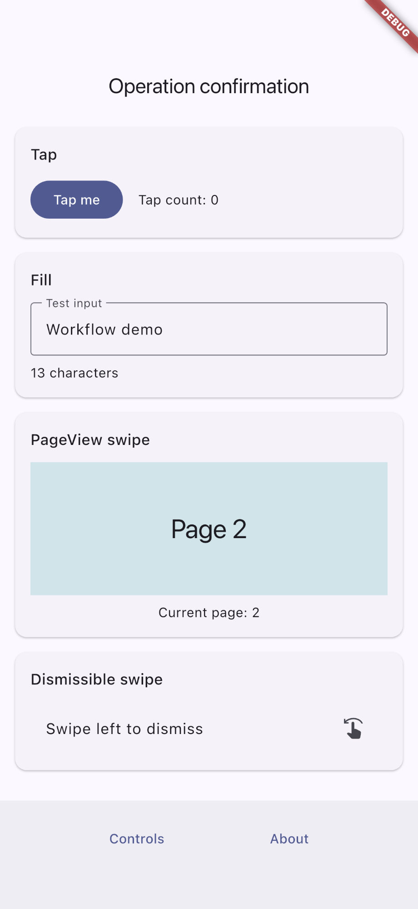
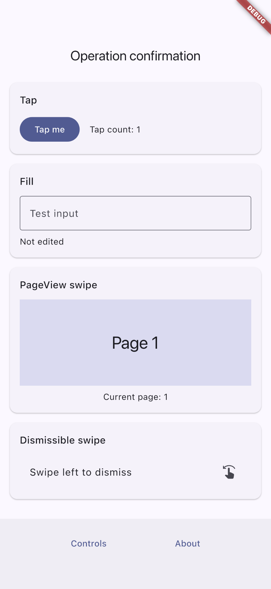

# Workflow v1 検証

担当: GPT-6 Astra。2026-09-09、macOSから実装CLIを実行。仕様は[workflow v1](../workflow-file-spec.md)、再実行用スクリプトは[integration_test/workflow_smoke.dart](../../integration_test/workflow_smoke.dart)。

環境: Flutter 3.47.2 / Dart 3.13.2、marionette_mcp 0.6.0、marionette_flutter/binding 0.6.0。iPhone 17 Pro Max、iOS 26.2、Simulator ID 59AA2C66-0A43-4E6B-9B63-63B7E38F72F9。operation_confirmationにControls/Aboutのタブを追加した。

## 自動検証

パッケージディレクトリで実行:

```sh
dart format .
dart analyze
dart test
```

format成功、analyze指摘なし、全108テスト成功（既存64件、workflow関連44件）。入力subset・全件binding・schemaと同梱例・CLI・queue・timeout・配送結果・秘匿範囲を検証した。別CLIプロセスでの最終ref保持と失敗details往復も含む。旧protocol 1のhandshakeは要求送信前に拒否し、配送失敗はunknown/progressKnown:false、再送0回を確認した。

親/step Executionのテストでは、3mutation各1回、失敗後停止、同一sessionの割込み防止と別sessionの進行、waitのinspectのみのpoll、完了済みchildの送信禁止、遅延応答から再接続/refを変更しないことを確認した。先行tap成功後の対象なし・wait timeoutはnot_sent/completedSteps:1、2step目送信中の断線・timeout・未分類例外はunknown/completedSteps:1となる。

operation_confirmationではdart format、flutter analyze（指摘なし）、flutter test（4件成功）を実行した。

## Simulator

アプリディレクトリで起動:

```sh
flutter run -d 59AA2C66-0A43-4E6B-9B63-63B7E38F72F9 --debug --no-pub
```

VM Service URIを非公開の一時ファイルに保存し、パッケージディレクトリで実行:

```sh
MARIONETTE_TEST_VM_URI_FILE=/tmp/mra-workflow-uri \
MARIONETTE_TEST_EVIDENCE=docs/verification/workflow-results.json \
dart run integration_test/workflow_smoke.dart
```

各操作は実装CLIの別プロセス。20呼出しの終了コード・応答・秘匿済み診断を[JSON証跡](workflow-results.json)へ保存した。

| コマンド・対象 | 期待結果 | 実結果 |
| --- | --- | --- |
| workflow schema tap | session nullで単独schemaを取得 | 成功 |
| workflow validate reach-controls.yaml / fill-input.json | 接続なしでtemplate検証 | 成功、必要inputを返す |
| validate fill-input.json --check-inputs | 必須input不足を拒否 | INVALID_ARGUMENT、exit 2 |
| validate fill-input.json --inputs inputs.example.json | binding検証 | bound / inputsValidated true |
| connect → snapshot | 新規アプリの状態 | Tap count 0、Page 1 |
| workflow run reach-controls.yaml | About→Controls、wait exists、左300px swipe、最終snapshot | 6step成功、Page 2、requiresSnapshot false |
| fill 最終snapshotのtext_input ref → snapshot | 別CLIからのref継続 | Workflow demo、13 characters |
| workflow run reach-controls.json → 別CLI fill | YAMLと同じ到達状態 | 6step成功、Page 2、13 characters |
| workflow run fill-input.json --inputs inputs.example.json | workflow内で入力をbinding | 2step成功、13 characters |
| workflow run stop-on-missing.json | 最初のtap後、不存在targetで停止 | stepIndex 2 / completedSteps 1 / TARGET_NOT_FOUND / not_sent / exit 4 |
| snapshot → screenshot | 後続tapが未実行 | Tap count 1のまま |
| close | 検証session終了 | 成功 |

実行ログに加え、以下のPNGを目視確認した。表示されたWorkflow demoは公開のサンプル値であり、snapshotの秘匿対象ではない。





## 制約

workflowはUI操作をrollbackしない。完了済みstepを自動で再実行してはならない。返却refは後続のsnapshot・mutation・closeで失効し、次のCLIまでの独占を保証しない。

sensitiveはdefault禁止のmetadataであり、アプリが表示した値は公開snapshotに含まれ得る。引数やbackend例外を実行報告・診断へ複写しないこととは別の契約である。

identifierは固定bindingで非対応。座標、screenshot/logs、session寿命の操作、分岐・loopはworkflow v1の対象外。waitのtimeoutは切断・ref失効となり、再connectが必要。IPCは2のため、旧daemonは旧CLIでcloseしてから接続し直す。

yaml内部scanner APIへの依存はloaderだけに閉じ、3.1.4を完全固定した。更新時はsubsetテストを再実行する。定型処理のLLM往復を集約できるが、token削減率は測定・保証していない。

## W07 レビュー指摘3件の修正

担当: GPT-6 Astra。daemonの応答生成・配送失敗時にもworkflowのsessionとunknown/progressKnown:falseを返すようにした。実daemonでtap→64 MiB超snapshotを実行する回帰テストにより、tap 1回実行済みでもnot_sentと報告しないことを確認した。最終snapshotを含む実行結果を配送できないため、進捗を推測しない。

入力parse後とCLI側の検証完了後に絶対deadlineを再確認する。約900 KiBのYAMLと30ms指定でTIMEOUT/exit 5を確認した。Controls画面は再生成されるため、Aboutへの移動時に文字数とページ番号を初期状態へ戻す。hello入力・Page 2へswipe後のタブ往復で、空入力・Not edited・Current page 1をwidget testで確認した。

検証: パッケージのdart format・dart analyze成功（指摘なし）、dart test全110件成功。fixtureのflutter analyze成功、flutter test全5件成功。Simulator用workflow_smokeにはタブ往復後の状態・画像確認を追加し、現在は24回のCLI呼出しを実行する。元の20回の記録は上記に保持し、修正後の結果は[W07 JSON証跡](w07/results.json)へ記録する。

実行コマンド（アプリを新規起動し、パッケージディレクトリから）:

```sh
MARIONETTE_TEST_VM_URI_FILE=/tmp/mra-w07-uri \
MARIONETTE_TEST_EVIDENCE=docs/verification/w07/results.json \
dart run integration_test/workflow_smoke.dart
```

期待結果: JSON/YAMLの各6step、別CLIからのfill、不存在targetでの停止が維持される。その後About→Controlsで空入力・Not edited・Page 1となる。実結果: 24呼出しが成功し、snapshotと画面で期待状態を確認した。


